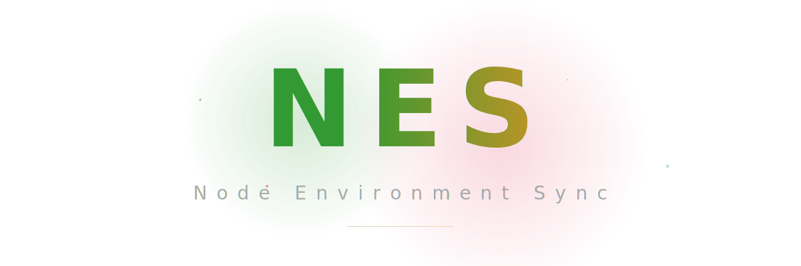

# NES (Node-Environment Sync) - Manager & Synchronizer

**NES** is an ultra-minimalist, portable, and powerful Node.js version manager and complete environment synchronizer. A full replacement for `nvm-windows` with a mission: **"Zero-Config, Zero-Install, Zero-Registry"**.

---

## Core Features

- **Portable-First**: Runs directly from its directory without requiring system-wide installation.
- **Environment Smart Sync**: Automatically identifies and installs compatible tools (Angular CLI, PNPM) for each Node.js version based on the `compatibility.json` matrix.
- **Intelligent Update**: Checks and upgrades the current Node.js to the latest patch version within the same major branch (e.g., v20.x -> v20.y).
- **Smart Uninstall (Force Kill)**: Automatically detects and terminates locked Node.js processes on Windows to ensure a clean uninstallation.
- **Junction-Based Switching**: High-speed version switching using junction links. No local administrator rights required after the initial setup.

---

## Installation Guide (Bootstrap)

Simply copy the NES folder to any location on your drive (D:, E:, USB...) and:

1.  Right-click on **`setup.ps1`** -> Select **`Run with PowerShell`**.
2.  **The script will automatically**:
    - Create version storage directory.
    - Initialize NES configuration.
    - Check for existing Node.js in `versions/` folder or download bootstrap Node.js (v22.x).
    - Create `current` junction link.
    - Install NES dependencies (chalk, semver, cli-table3, adm-zip).
    - Configure Windows User PATH.
    - Migrate from legacy NVM (if exists).
    - Create `nes.cmd` command.

### Setup Steps:
```
[1/6] Checking version storage directory...
[2/6] Checking NES configuration...
[3/6] Checking Node.js installation...
[4/6] Creating junction link...
[5/6] Installing NES dependencies...
[6/6] Configuring Windows System PATH...
[Optional] Checking for legacy NVM...
[Final] Creating nes command...
```

*Note: Restart your Terminal, VS Code, or CMD after the initial setup for the `nes` command to take effect.*

---

## Usage

Open your terminal and type the main command:
```powershell
nes
```

### Main Menu:
1.  **Status**: Environment Sync Dashboard
2.  **Manage**: Node.js Engines (Arrow Navigation)
3.  **Plugins**: Manage Managed Packages
4.  **Exit**

### Node.js Engines Manager Controls:
- **Arrow Up/Down**: Navigate version list
- **Enter**: Open Action Menu
- **Backspace**: Return to main menu

### Action Menu:
- **[1]**: Install or Use selected version
- **[2]**: Update to latest version
- **[3]**: Delete version
- **[Backspace]**: Cancel / Return

---

## Portable Architecture

NES operates entirely within its own isolated environment:
- `versions/`: Stores physical Node.js folders (format: vX.X.X).
- `current/`: A junction link pointing to the active version. Your PATH points here.
- `compatibility.json`: The "brain" containing compatibility rules for Angular, PNPM & Node.
- `nes_config.json`: User configuration for managed packages.
- `index.js`: The core logic engine.
- `setup.ps1`: Bootstrap installer.

---

## Troubleshooting

**EPERM Error (Permission Denied):**
Common on Windows when trying to delete or modify a Node version currently used by another program.
- **NES Solution**: Automatically prompts to "Force Kill" active processes from that version to ensure successful cleanup.

---

## Expansion
To support new tool releases, simply update the `compatibility.json` file with new rules, and NES will start synchronizing automatically!

---
**NES - Clean, Powerful, Always Synced.**
